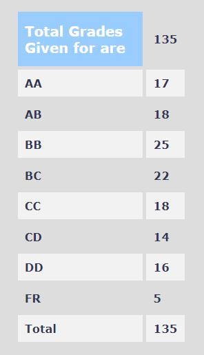

### EE 204 – ANALOG CIRCUITS

**Academic year :**

Spring 2018

**Professor :**

Prof. Dipankar Saha

**By the end of the course, one should:**

- Have a thorough understanding of the various aspects of MOSFET and be able to design amplifiers using MOSFETs.
- Be able to understand the working of various types of oscillators and feedback systems for a variety of configurations.
- Get the same intuition for OPAMP devices and be able to design circuits using OPAMPs to obtain various types of output signals, given the input.
- EE204 is one of those courses which stresses more on the practical aspects of engineering and designing. This is one of the major takeaways from this course.

**Course content and structure :**

The official content can be found here : https://www.ee.iitb.ac.in/web/academics/courses#EE204.
The course content is followed according to the one mentioned above, but there can be some differences in the organisation, structure and some topics depending on the professor.
Segregating the course content followed by the professor into the following :

- MOSFET characteristics : Deals with the basic input-output characteristics of the MOSFET in different regions, small signal model and studying about different configurations like common source, drain and gate. Characteristing the high frequency response of the small signal model by making use of theorems like Miller. Studying various parameters like the cutoff frequency, gain, bandwidth, gain bandwidth product etc.
- Differential Amplifiers : building up of the differential amplifier from scratch, small signal common mode gain, common mode rejection ratio due to the mismatches in resistances, common mode signal.
- Feedback systems : Negative feedback and the four configuration systems of feedbacks, their input resistance, output resistance and gains.
- Positive feedback – Oscillators, Barkhausen criterion,
- OPAMPs : Different types of common OPAMPs and the concepts studied in MOSFET are applied to OPAMPs. Butterworth and Chebyshev filters, A/D and D/A converters. Designing of OPAMP circuits to obtain the required output.

**Marks distribution and grading stats :**

Prof. Dipankar Saha focused more on exploration of various concepts taught and practice them at the same time. So, he alloted 40 marks for the assignments solely, summing up to around 8 assignments at a frequency of 1 assignment/week. This kind of a system has helped the students study regularly and be at their toes. The problems in the assignments were made very challenging and demanded the use of some softwares like MATLAB for evaluating some expressions.

- Midsem – 20 marks

- Endsem – 20 marks

The professor encouraged open book system and ample time was given during the endsem. (4 hours)

**Grading statistics –**

Pretty good. With around 10 AAs out of 65 grades.

**Prerequisites :**

There are no requisites for the EE students, since they will have done EE112 and EE207 prior to this course. For non EE students, EE-101 is a must.

**Difficulty :**

Medium/moderately hard. Requires self study and takes a good amount of time along with some practice when it comes to the designing aspect. This course demands you to use some intuition and think practically.

**Miscellaneous :**

To perform decently in Prof. Dipankar Saha’s courses, follow these two blindly :

- Make good notes in his class. (Even if it doesn’t make any sense in the class!)
- Attend all the classes. (Even if he says that the attendance is not compulsory)
As such, the professor did not follow any one textbook in particular and students generally refer to his notes.

Razavi is one of the books which cover a fair amount of his content, but the organisation is quite different. You’ll have to scout through the pages and read only the stuff taught in class.