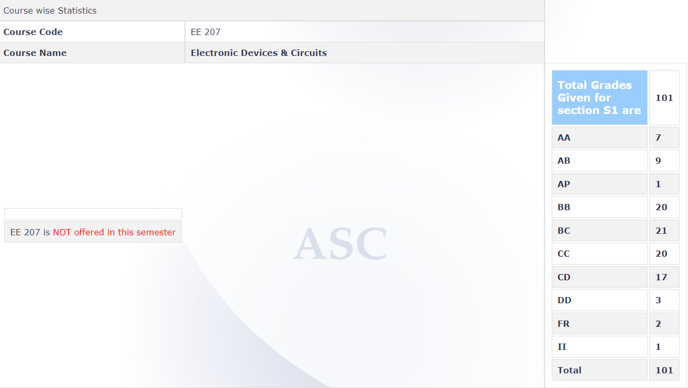

**Review by**

Shivam Patel, 2024(BTech)

**Course Offered In**

SPring 2021

**Instructors**

Prof Mahesh B. Patil (for S1-Btech section)

**Prerequisites**

EE 204 Analog Circuits (soft prerequisite)

**Difficulty**

Course content was easy, but exams were somewhat on the difficult side.

**Course Content**

This course aims to cover the basics of semiconductors and the mathematics behind them. You will learn about mathematical derivations of all the device equations that you would have encountered in EE 204. The initial part of this course covers the various aspects of carrier transport and pn junctions. Then we learnt about BJTs, JFETs and MOSFETs. The slides are available at [[https://www.ee.iitb.ac.in/\~sequel/course_material.html]{.ul}](https://www.ee.iitb.ac.in/~sequel/course_material.html).
The content was easy to understand, but tough to remember.
 
**Feedback on Lectures**

The lectures were good, and all formulae discussed were mathematically derived in the class. Taking notes is immensely helpful in this course, even though the slides are complete by themselves. Making detailed notes helped in the exams, as they were open book. Don't miss any lectures, otherwise it becomes very difficult to catch up, as everything is built upon the previous content. Reading up the slides before going to the lecture may help a lot.

**Feedback on Evaluations**

We had 2 quizzes(10% each) and midsem, endsem (40%each). The exams were subjective, and we had very little or no partial marking. Marks were given only if the accurate answer was calculated and mentioned in correct units. Calculator is necessary for all exams. Taking adhoc/unjustifiable assumptions about the conditions mentioned in the
questions can be detrimental, leading to the wrong answer. Grading was absolute (as in a previous offering also), with 90/100 being the AA cutoff. About 8/100 students got an AA.

**Study Material and References**

There are some recommended books, but not at all necessary to score well. They are just for learning something extra out of curiosity.

**Follow-up Courses**

This course is a prerequisite for all device physics courses, like NanoElectronics, Solid State Devices and other similar courses.

**Final Takeaways**

Scoring good is relatively easy in this course, you just have to avoid silly mistakes, and recheck your valid assumptions and calculations.  

All the Best !!

**Grading Statistics:**
