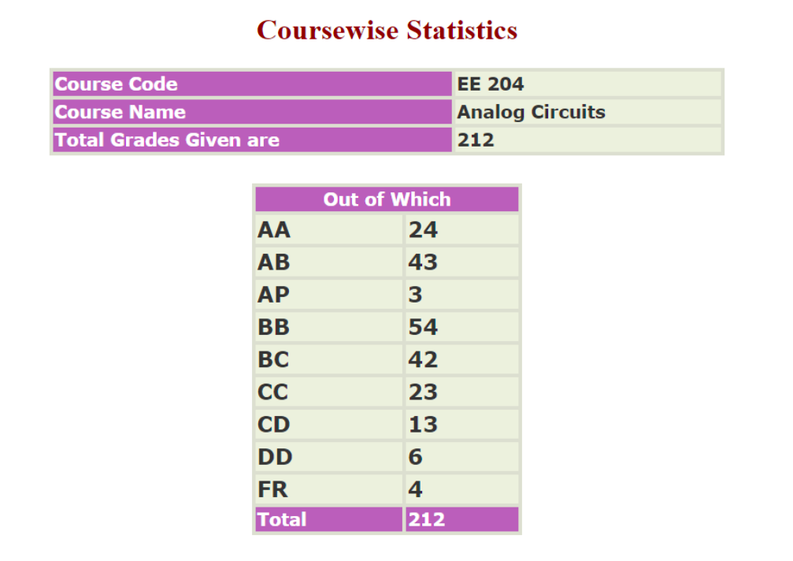

### EE 204 – Analog Circuits (2021)

**Course offered in:**

Autumn 2020

**Instructors:**

Prof. Rajesh Zele

**Course Content:**

The following topics were covered as a part of this course:

– Op amp: The ideal op-amp, different circuit configurations and effects caused by non-idealities  
– PN junction diodes: Terminal characteristics, forward and reverse bias, 
approximate circuit models for junction diodes, rectifier circuits  
– BJTs and MOSFETs: Modes of operation and working, relevant equations for current/voltage 
(Note: Details of how these basic equations come about aren’t explored here, and are covered in EE 207 instead), 
current-voltage characteristics, large and small signal models, biasing  
– Current Mirrors, Differential Amplifiers and other common building blocks of analog circuits: From here on, 
both BJT and MOSFET circuits are covered in parallel, and the instructor made sure to highlight the nuances of the transistors’ configurations  
– Basics of frequency response

**Prerequisites:**

N/A

**Feedback on Lectures:**

Since this course ran in an online semester, we were given around 2-3 one hour long pre-recorded lectures to watch each week. 
The lectures were very detailed and lucid, and were sufficient to directly start solving questions in the topic.  

We also had one of the regular lecture slot used for doubts/reiterating important concepts covered for that week, which was highly useful. 
We also had a SAFE quiz in the other lecture slot of about 10 questions in 30-40 mins every week, 
which all added up to have significant weightage for final evaluation. Right after each quiz, we had a TA session, 
where the TAs explained the solutions of the questions we just solved in the quiz.  

Since the concepts build up pretty quickly, it was important to keep up to date with the lectures, 
since the complexity of circuits and the problems in the quizzes builds up fairly quickly.

**Feedback on Tutorials, Assignments and Exams:**

Along with the weekly quizzes, the midsem and the endsem had an objective/fill in the blank type SAFE quiz, along with an additional subjective paper. Both these exams were also exactly on par with the level of the quizzes. Although the lectures covered enough material to solve the quiz questions, to get a good score, it’s highly recommended to pick problems up from the reference books listed below (the instructor even chose a few representative problems for us to solve from these books to get some practice) to answer quickly and accurately.  

An added feature of this course running in the online semester was that we were allowed to use a cheat sheet (with strictly only formulas, no graphs/circuit diagrams) for midsem, and two for endsems, which made things much easier since we didn’t have to worry about cramming the many formulas that were introduced.

**Difficulty:**

About 3/5. Concepts are easy if you pay attention in class, but need to put in consistent efforts and spend time 
outside lecture hours to practice for the quizzes.

**Grading Statistics:**

**Study Material and References:**

The instructor provided handwritten notes for each lecture.  

The following references were suggested (both have significant overlap, so any one should be fine):  
– Microelectronic Circuits - Sedra, Smith  
– Microelectronics – Behzad Razavi

**Advanced courses that can be taken after this:**

Any microelectronics/VLSI course

**Takeaways from the course:**

This is a very fundamental course, since the basic transistor circuits are introduced here. 
Most courses build up on these topics, which is why it’s necessary to get a good understanding of the topics covered here. 
Also, since this is a core topic, questions from analog are bound to pop up in interviews for hardware profiles.

Review by – Saketika Chekuri (saketikachekuri@gmail.com)
