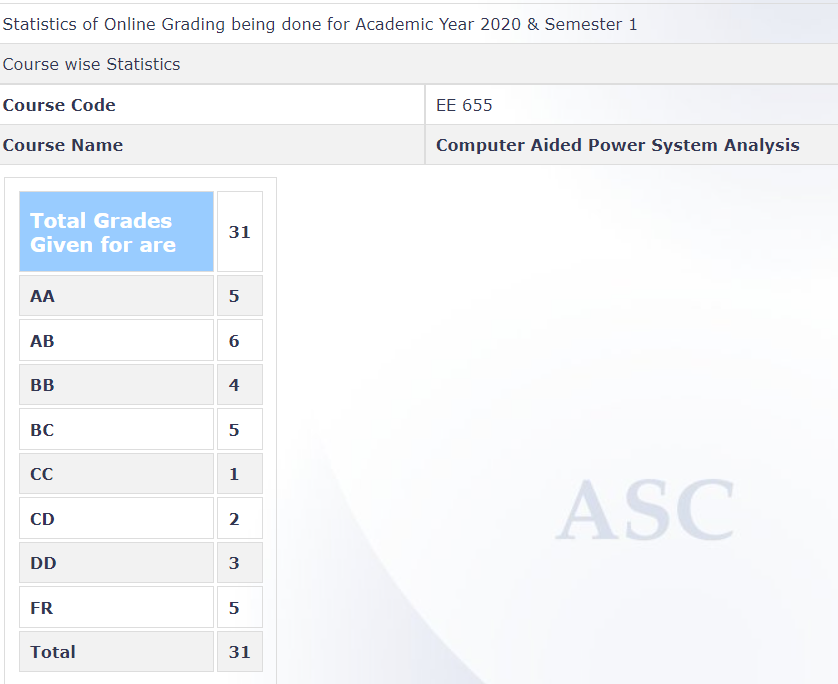

**Review by**
Immanuel Williams, EE DD PEPS 2018-2023

**Course Offered In**
Autumn Semester

**Instructors**
Prof. Anupama Kowli

**Prerequisites**
A working knowledge of basic power systems. Therefore, it would be recommended if EE334 was done prior to this but if not, it is not an issue as the instructor provides sufficient material to review basic power system concepts.

**Difficulty**
It is not a really tough course. It is very easy if handled in a proper manner.

**Course Content**
Loadflow for AC systems, fast decoupled load flow, optimal power flow.;Z - matrix for short circuit studies.;State estimation, LO algorithm, fast decoupled state estimation.;Security and contingency studies. Unit Commitment. Load frequency control.;Optimal hydro-thermal scheduling. AI applications.
 
**Feedback on Lectures**
The lectures are really good. The instructor takes a lot of effort in communicating the ideas and is willing to go over the concepts over and over again if there is a doubt.

**Feedback on Evaluations**
The evaluations for this course are not that tough really. The best part of this course is that the instructor wouldn’t deduct marks for propagation of errors across different subparts in a main question so the intent of the evaluation is to understand whether the concepts itself have been grasped by the students.

**Study Material and References**
NA

**Follow-up Courses**
EE651 (Digital Protection of Power Systems) and EE722 (Restructured Power Systems)

**Final Takeaways**
The course is a very easy course, undertaken by an amazing instructor. It is a learning oriented course so don’t worry about the grades too much and focus on the learning objectives.

**Grading Statistics:**

