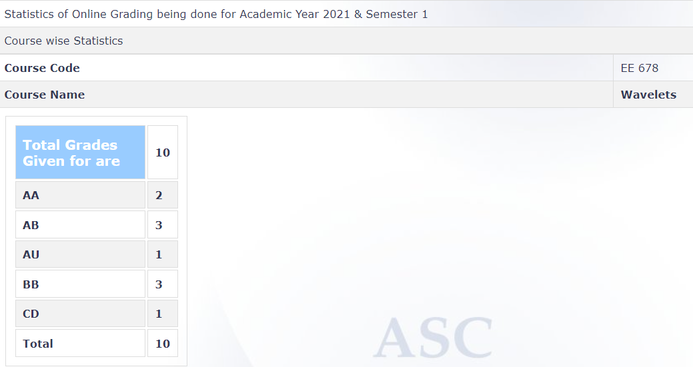

---
layout: page
title: EE 678 – Wavelets (2021)
cover-img: assets/img/Cover_study.jpg
thumbnail-img: ""
share-img: ""
comments: true
tags: [Elective, Signal Processing]
---

**Review by**
H R Sai Sumedh, 2023(DD)

**Course Offered In**
2021-Autumn Semester

**Instructors**
Prof. Vikram Gadre

**Prerequisites**
This is an advanced course on signal processing. A first course on signal processing- EE229, or equivalent, is a prerequisite for taking this course.

**Difficulty**
Moderate (3/5). Although more advanced concepts are covered in the latter part of the course, the method of instruction ensures sufficient clarity.

**Course Content**
In a basic signal processing course, the usefulness of performing analysis in a transform domain (like the Fourier transform, in which the ‘frequency’ is the independent variable) is highlighted. Although useful, working in the frequency domain leads to loss of ‘time-localization’, which is also crucial in many real-world scenarios. 

This course builds a framework which allows us to perform simultaneous time-frequency localization and multiresolution/multirate signal processing. The contents of the course deal with the fundamental limits of such a simultaneous localization, and methods to achieve a good degree of localization using wavelet transforms. The course also stresses the interconnectedness of these approaches with machine learning.

The course contents are:

1. Examples of practical situations- image processing/ compression, etc where simultaneous localization in two domains is needed, and the emergence of wavelets, time-frequency methods
1. The Haar wavelet and multiresolution analysis (MRA)
1. Dyadic MRA, filter banks, discrete wavelet transform, multirate systems
1. Families of wavelets, conjugate quadrature filter banks (and their design) 
1. Data compression- JPEG2000
1. Uncertainty principle of signal processing, gabor transform, continuous wavelet transform
1. Discretization of scale, translation, time/space
1. Spline wavelets
1. Implementation of wavelet transform
1. Wave packet transform
1. Realization of filter banks

**Feedback on Lectures**
The instructor is known for his unique approach to pedagogy (teaching)- the students are expected to take initiative to learn concepts. Our offering of the course was run online, so we were asked to watch lectures from the Professor’s lecture series on nptel. These lectures were very detailed, clear and understandable. In every interactive session, student volunteers summarized the particular lecture scheduled, with the instructor highlighting and explaining key concepts. Students were encouraged to pose and answer questions on the lecture content. Additionally, the instructor himself sometimes posed ‘challenge’ questions, which required some thought, and could be solved and presented in interactive sessions. 

**Feedback on Evaluations**
The instructor is again known for his unique evaluation scheme- there were no exams in the course. Evaluation consisted of class interaction and 2 R&D projects. However, this may change in subsequent semesters. 

Students were expected to actively participate in class activities (each of these had marks associated) such as presenting lecture summaries, posing questions, answering questions posed by others/ by the instructor, and work sufficiently hard on the R&D projects (one of which was our choice and another allotted by the instructor) in association with mentors (PhD students). 

The R&D projects were given high weightage. They involved solving current research problems (to a fair extent, as permitted by the time available) by going through the literature, catching up on the work done by the mentors, and continuing this work (learning concepts, implementation and obtaining results were all important). There were multiple evaluations of the projects through the semester- including a mid-term evaluation, intermediate evaluation and final evaluation (most of which required making a report, and some involved making videos). The feedback given by the instructor after each evaluation was very specific and useful for further progress. Students were encouraged to explore applications of machine learning using wavelets, time-frequency methods, etc.

This is a course which requires consistent effort throughout the semester, and rewards efforts suitably. In the instructor’s own words, “if the whole class has definitely performed exceptionally well in all components, the instructor would not hesitate to recommend ‘AA’ Grade to all students, for example and, on the other hand, if every student has performed abysmally in every component, the instructor would not hesitate to recommend ‘CC’ Grade for every student of the class”.

Although the course demands significant effort, it is well worth it. The instructor is deeply interested in the students’ learning and attempts to impart a deep understanding of the concepts by encouraging students to think. One can expect a firm understanding of the concepts involved after taking this course.

**Study Material and References**
The instructor’s lectures were extensive and very detailed, and no additional study material was required as such. 

**Follow-up Courses**
None

**Final Takeaways**
This course is on advanced topics in signal processing, including time-frequency methods and multiresolution/ multirate signal processing. It demands significant effort throughout the semester, but is very rewarding, in terms of concepts learnt and grades (since there were no exams, sustained work through the semester on class participation and projects mostly led to good grades). This course is highly recommended for those interested in using time-frequency methods with machine learning.

**Grading Statistics:**
