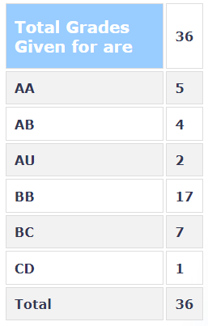

**Review by**

Prakhar Diwan, 2023(DD)

**Course Offered In**

Spring 2021

**Instructors**

Prof Biswabandan Panda

**Prerequisites**

There are no formal pre-requisites for the course. You can visit the course webpage for pre-req resources (basics of OS & Computer Architecutre).

**Difficulty**

4/5. The course was moderate till midsem, but later doing paper review, presentation along with project work got hectic.  

**Course Content**

Course Webpage: https://www.cse.iitb.ac.in/~biswa/courses/CS773/main.html

*Performance module*
1. Microarchitectural bottleneck (front-end and back-end) analysis with desktop, mobile, and servers. 
2. Microarchitectural front-end and back-end optimizations: caching, prefetching, TLBs, MMU caches 
3. Memory hierarchy for multi/many-core systems including cache coherence and memory consistency mechanisms. 
4. Emerging memory systems: Embedded DRAM, HBMs, NVMs like persistent memory (Intel Optane) 

*Security module* 
1. Transient execution attacks: Spectre, Meltdown, etc. 
2. Timing and conflict-based channels through caches, TLBs, prefetcher, BTBs, branch predictors, and DRAM controllers: attacks and mitigations 
3. Microarchitecture of Trusted Execution Environments: Intel SGX, ARM TrustZone, Keystone 
4. Physical attacks: Row-hammer, data remanence, and cold boot attacks, Reverse-engineering microarchitectural units, DNN models through microarchitecture, performance/security tradeoffs
 
**Feedback on Lectures**

Initially few lectures were conducted on basics of computer architecture and hardware security for eg. cache hierarchy, attacks based on caches, decoupled front-end etc. Readings to be done were also provided. Tutorials were conducted on reviewing and presenting a research paper.  

After this every lecture 2-3 paper presentations were done by students and discussions were held on these. Some lectures also had professor presenting modern topics like Domain Specific Architecture, Microarchitecture for high-speed network I/O etc, and then class discussions on it were done. A few lectures were used for checkpoint evaluations consisting of project presentations from student groups.
Attending lectures is fruitful if you are interested in research in computer architecture, as you get exposed to various ideas.

**Feedback on Evaluations**

Evaluation consisted of 5 paper presentations (1 per member), 5 paper reviews (individually submitted) and a group project focussed on performance, security or both. It involved 3 checkpoints, each consisting of report and presentation submissions. 1 paper review and presentation were assigned every 2 weeks to each group. There were **no** exams in this course :D 

Professor expected high quality work from students on all evaluations. There are incentives if you put in the work like bonus marks (on best review, presentation) and direct AA grade (on excellent project). 

The project got delayed for our batch. People had issues in finding proper facilities for carrying out the project. Apart from this course had no issues.

**Study Material and References**

1. Hennessy and Patterson, Computer Architecture, Morgan and Kaufmann Publishers, year: 2017 
2. Arpaci-Dusseau and Arpaci-Dusseau, Operating systems: Three easy Pieces, year:2015 (https://pages.cs.wisc.edu/~remzi/OSTEP/) 
3. Synthesis lectures on caching, prefetching, memory systems, virtualization, and security (https://www.morganclaypool.com/toc/cac/1/1), year: 2010 to 2021 
4. Research papers from flagship conferences like ISCA, MICRO, HPCA, PACT, ASPLOS, Usenix Security, S&P, and NDSS

**Follow-up Courses**

N/A

**Final Takeaways**

This course develops the ability to think critically and exposes you to research in field of computer architecture. It teaches you how to read, review and present research work; and also how to contribute in the field.  

If you want a chill course then this one ain't for you. This course can be tagged as specialization elective for microelectronics students. A similar course EE 748 is offered by the department.   

**Grading Statistics:**

