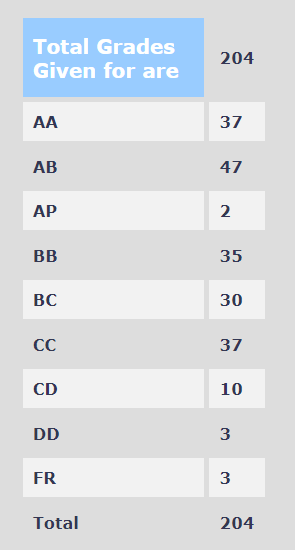

**Review by**

Suraj Sarvesha Samaga, 2023(BTech.)

**Course Offered In**

Spring 2022

**Instructors**

Prof. Virendra Singh

**Prerequisites**

No hard pre-requisites, a basic understanding of digital electronics is enough. A background of EE 309 - Microprocessors will be beneficial. 

**Difficulty**

4/5 

**Course Content**

- History and evolution of computers
- Basic architecture of a microprocessor, including registers and buses
- Steps for a single instruction, FSMs for every instruction
- Creation of level 1 and level 2 flow charts
- Memory systems in a microprocessor
- Virtual memory, storage method in memory caches, process scheduling 
- Pipelining and parallelism 
- VLIW architecture
- Cache misses 
- Branch predictors and branch misprediction
- Superscalar architecture (Executing individual instruction in not specifically the same order as the program to save resources and time)
- Multithreading

The course content gives one an insight into the workings of a microprocessor, and the various subsystems inside it. There were two course projects: one on Pipelined Processor Design and the other on Superscalar Processor Design.
 
**Feedback on Lectures**

First half of the course was online, so the prof annotated on his slides. Post-midsem, the course followed black-board teaching. Open conversation to and fro with the prof is always encouraged. Since the content and scope of this course is very large, extra classes were organized on Saturdays, sometimes on Sundays as well. It is recommended to attend as many lectures as possible for maximal understanding of the course, as there is no back-up. 

**Feedback on Evaluations**

 Evaluations are through class quizzes, midsems, endsems and projects. Midsems and endsems, are open book exams, and subjective. One would need to be well versed with the course content to answer questions properly. The end semester exam consisted of 2 sections, 1 was timed, while the second one had unlimited time.

 Projects are considerably complex and time-consuming, and to be done in teams of 4. A viva was conducted at the end in which each group had to explain their work.
 
**Study Material and References**

Research papers mentioned in class, previous years' slides and recordings.

**Follow-up Courses**

EE 748 - Advanced Topics in Computer Architecture

**Final Takeaways**

This course is very important for anyone who want to pursue a career in digital electronics and processor design. Attending lectures and submitting projects in time should lead to a decent grade. 

**Grading Statistics:**

