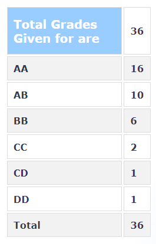

**Review by**

Anonymous

**Course Offered In**

Autumn 2021

**Instructors**

Prof. Madhav Desai

**Prerequisites**

Digital Systems

**Difficulty**

Easy

**Course Content**

Starts with recap of FSM and it’s characteristics. Introduction to notion of Petrinets. Detailed analysis and study of Petrinets, distinction with traditional FSMs, relevance of Petrinets to AHIR. Study of AHIR, advantages over traditional RTL, Study of building blocks of AHIR, realization of said building blocks using VHDL, examples of digital design using AHIR.
 
**Feedback on Lectures**

Comprehensive and clear. Attending lectures mindfully is all that is needed.

**Feedback on Evaluations**

Assignments and projects, take-home midsem and endsem. Relatively easy if attended all lectures.

**Study Material and References**

None

**Follow-up Courses**

N/A

**Final Takeaways**

Overall a great course for anyone interested in digital design. Provides a new perspective as opposed to traditional RTL.   

**Grading Statistics:**

