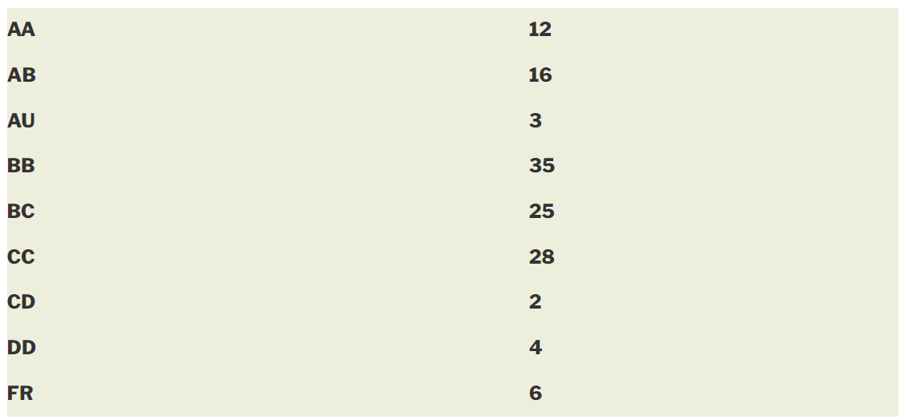

---

layout: page

title: Course Reviews

subtitle:

cover-img: assets/img/Cover_study.jpg

thumbnail-img: ""

share-img: ""

comments: true

tags: [Academic]

---

  
  

###  CS 663 – DIGITAL IMAGE PROCESSING

  
  

**Course offered in:**

  
  

Autumn 2014
  
  

**Instructors:**

  
  

Prof. Suyash Awate

Prof. Ajit Rajwade

  
  

**Course Content:**

  
  

The official content is here: [http://www.iitb.ac.in/asc/Courses/crsedetail.jsp?ccd=CS%20663](http://www.iitb.ac.in/asc/Courses/crsedetail.jsp?ccd=CS%20663). It is followed to quite a large degree.

Introduction – discussion on what digital image processing is, how images are acquired, etc.

Image enhancement  – discussion on certain methods of image enhancement by gray-level transformations, such as histogram equalization. This is followed by a discussion on spatial filtering, and other filtering.

Frequency Domain Processing – discussion on fourier analysis, and frequency domain filtering, which is followed by applications of filtering, and some important mathematical background.

Face Recognition – one of the most challenging and interesting parts of the course, introduction to eigenfaces, and the algorithm for face recognition which uses Principal Components Analysis, and detailed discussion on the same.

Image restoration, and image denoising – introduction to the Weiner filter

Image segmentation – introduction to clustering, and the mean shift algorithm for image smoothing and clustering.

Image compression – discussion on paradigms for image compression, and how the JPEG standard works.

  
  

**Prerequisites:**

  
  

There are no prerequisites as such, but a basic understanding of signals and systems is extremely helpful.

  
  

**Feedback on Lectures:**

  
  

Lectures are pretty interesting and most are easy to follow, although they do require significant effort to be put in beyond class for complete understanding, especially if one does not have a background of the topic being taught.

  
  

**Feedback on Tutorials, Assignments and Exams:**

  
  

There are five programming assignments given, in MATLAB, based on the topics which have been covered in class. The assignments often take time, especially if one has never used MATLAB before. The assignments are interesting, and add to the understanding of the topics covered in class. There is also a course project, to be done in groups, in which each group is expected to implement a research paper.

Exams are reasonably easy, and do not require any preparation, if one is following the classes regularly.
  
  

**Grading Statistics:**

  
  

  
  

**Study Material and References:**

  
  

Both professors give detailed lecture slides, and also upload any other material which they refer to.

  
  

Reviewed by **Kush Motwani (kushmotwani1@gmail.com)**
